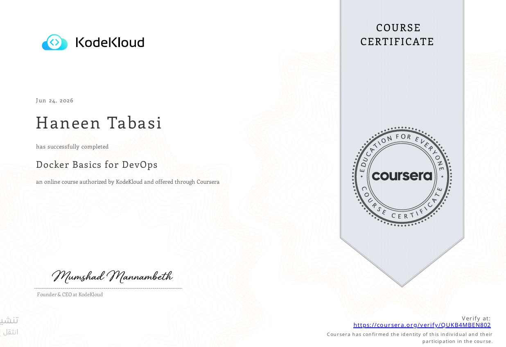

# 🐳 Docker Basics for DevOps

This repository documents my hands-on work from the **Docker Basics for DevOps** course by [KodeKloud](https://kodekloud.com), completed via Coursera on **June 24, 2026** with a grade of **92.06%**.

## 📜 Certificate

> Verified at: https://coursera.org/verify/OUKB4MBEN802

---

## 📁 Repository Structure

| Folder | Topic |
|--------|-------|
| [01-fundamentals](./01-fundamentals/) | Docker core concepts, containers lifecycle |
| [02-images](./02-images/) | Docker images, Dockerfile, custom builds |
| [03-networking](./03-networking/) | Docker networks, bridge, host, custom |
| [04-volumes](./04-volumes/) | Data persistence, bind mounts, named volumes |
| [05-devops-integration](./05-devops-integration/) | Docker in CI/CD workflows |

---

## 🛠️ Tools & Technologies

- Docker Engine
- Dockerfile
- Docker CLI
- Docker Networks & Volumes
- GitHub Actions (CI/CD integration)

---

## 👩‍💻 Author

**Haneen Tabasi**  
Network Engineer & DevOps Instructor — Al-Aqsa University, Gaza  
GitHub: [github.com/heno3](https://github.com/heno3)
